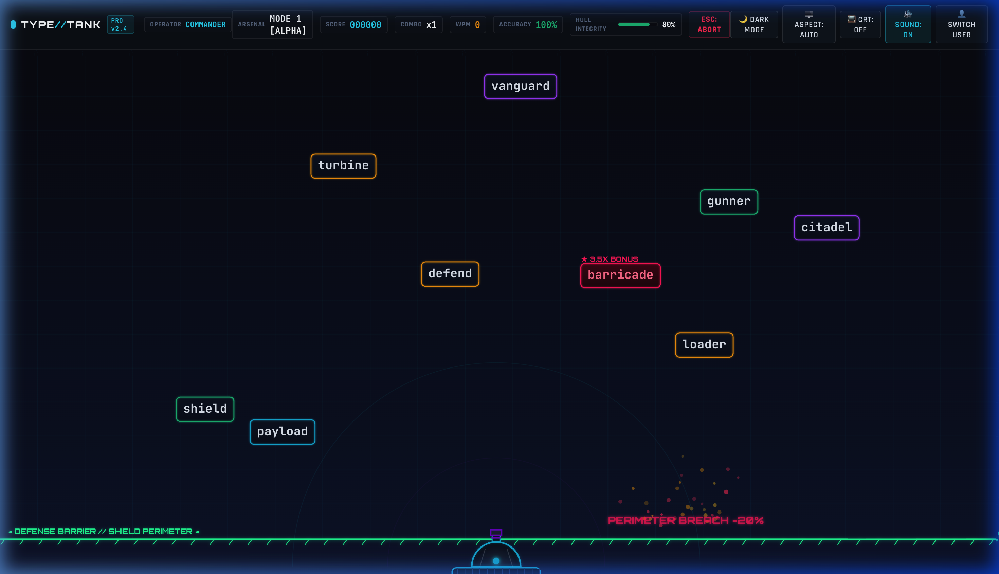

# 🎯 TyperGame (TYPE//TANK)

<div align="center">

  [](https://typegame.web.app)
  [](https://typegame.web.app)
  [](https://github.com/Shahreyaarr/TyperGame)
  [](https://typegame.web.app)

  <br /><br />

  <h1>🚀 <a href="https://typegame.web.app">Play Live Game: https://typegame.web.app</a> 🚀</h1>

  <p><strong>Defend the perimeter, lock on targets, and fire ballistic strikes by typing with speed and pinpoint accuracy.</strong></p>

  <br />

  <a href="https://typegame.web.app" target="_blank">
    
  </a>

  <br /><br />

  <p>
    👉 <a href="https://typegame.web.app"><strong>Click Here To Play TyperGame Live (No installation required)</strong></a> 👈
  </p>

  <p>
    <a href="#-live-demo">Live Demo</a> ·
    <a href="#-about-the-game">About</a> ·
    <a href="#-key-features">Key Features</a> ·
    <a href="#-controls--shortcuts">Controls</a> ·
    <a href="#-tech-stack">Tech Stack</a> ·
    <a href="#-local-development">Local Setup</a>
  </p>
</div>

---

## 🌐 Live Demo

You can play **TyperGame** instantly on any desktop or mobile browser with zero installation:

### 🔗 **[https://typegame.web.app](https://typegame.web.app)**

> ⚡ **Quick Tip:** Put on your headphones or enable system audio for synthesized retro laser fire, combo chimes, and tactical explosions!

---

## 🕹️ About The Game

**TyperGame (`TYPE//TANK`)** is an arcade-style tactical typing defense game designed to elevate your keyboard speed, reaction time, and typing precision. Incoming enemy drones, missiles, and heavy armor descend towards your command station with designated target codes. Type the matching target word to lock your turret, fire ballistic artillery, and vaporize hostile units before they breach your hull!

---

## ✨ Key Features

- **🎯 4 Tactical Arsenal Modes**:
  - **Cadet (Easy)**: Short words, standard descent speed, ideal for warmups.
  - **Sergeant (Medium)**: Moderate vocabulary, multi-target pressure.
  - **Commander (Hard)**: Extended technical words, faster projectiles.
  - **Ghost Protocol (Extreme)**: High-speed swarms and complex phrase defense.

- **🔊 Web Audio API Sound Engine**:
  - Procedural, synthesized retro audio effects (laser fire, explosions, combo chimes, alerts).
  - 100% self-contained — zero external audio files or network latency.

- **📊 Combat HUD & Real-Time Telemetry**:
  - Real-time **Words Per Minute (WPM)** computation.
  - Precision **Accuracy %** and dynamic **Combo Multipliers (x2, x3, x5)**.
  - Hull integrity defense gauge with visual damage alarms.

- **📺 Arcade Cabinet & Display Controls**:
  - **CRT Scanline & Phosphor Overlay**: Toggle vintage arcade monitor visuals.
  - **Aspect Ratio Switcher**: Auto, 16:9 widescreen, or 4:3 classic box.
  - **Theme Engine**: Instant toggle between Dark Ops (Cyberpunk) and Light Command themes.

- **💾 Persistent Operator Records**:
  - LocalStorage-backed high score leaderboards and sortie logs.
  - Personalized operator callsigns and preference persistence.

- **🎉 Visual Effects**:
  - HTML5 Canvas particle explosions, muzzle flashes, and victory confetti.

---

## 🎮 Controls & Shortcuts

| Key / Action | Command / Function |
| :--- | :--- |
| **Typing (A–Z)** | Target lock and fire ballistic cannon rounds |
| **ESC** | Abort current combat sortie / Return to tactical screen |
| **Enter** | Confirm / Launch mission / Acknowledge debrief |
| **Header Buttons** | Toggle Sound, CRT Filter, Aspect Ratio, Theme, and Operator Callsign |

---

## 🛠️ Tech Stack

- **Core**: Vanilla HTML5, CSS3, and JavaScript (ES6+ modular architecture)
- **Graphics**: HTML5 `<canvas>` rendering engine with 60 FPS animation loop
- **Audio**: Web Audio API (Synthesized oscillators & noise nodes)
- **Typography**: Google Fonts (*JetBrains Mono*, *Orbitron*, *Rajdhani*, *Outfit*)
- **Hosting**: Google Firebase Hosting ([https://typegame.web.app](https://typegame.web.app))

---

## 📂 Project Structure

```text
TyperGame/
├── index.html          # Main arcade cabinet and screen viewports
├── style.css           # Glassmorphism, cyber aesthetics & responsive layouts
├── preview.png         # Live game preview screenshot
├── firebase.json       # Firebase Hosting configuration
├── .firebaserc         # Firebase project binding (typergame)
├── .gitignore          # Git exclusion rules
├── README.md           # Documentation with live demo links
└── js/
    ├── app.js          # Screen router, modal controllers & UI event glue
    ├── audio.js        # Web Audio API synthesizer
    ├── game.js         # Core physics, canvas rendering & target tracking
    ├── storage.js      # Callsign, high scores & preferences storage
    └── words.js        # Vocabulary dictionary categorized by difficulty
```

---

## 💻 Local Development

1. **Clone the repository:**
   ```bash
   git clone https://github.com/Shahreyaarr/TyperGame.git
   cd TyperGame
   ```

2. **Run locally:**
   Since it uses pure vanilla JavaScript, you can open `index.html` directly in any modern browser, or use a local dev server:
   ```bash
   npx serve .
   # or
   python3 -m http.server 8080
   ```

3. **Deploy to Firebase:**
   ```bash
   npx firebase-tools deploy --only hosting --project typergame
   ```

---

## 👤 Author

**Shahreyaarr**
- GitHub: [@Shahreyaarr](https://github.com/Shahreyaarr)
- Repository: [https://github.com/Shahreyaarr/TyperGame](https://github.com/Shahreyaarr/TyperGame)
- Live Game: [https://typegame.web.app](https://typegame.web.app)

---

<div align="center">
  <sub>Built with ❤️ and pure vanilla web technologies.</sub>
</div>
